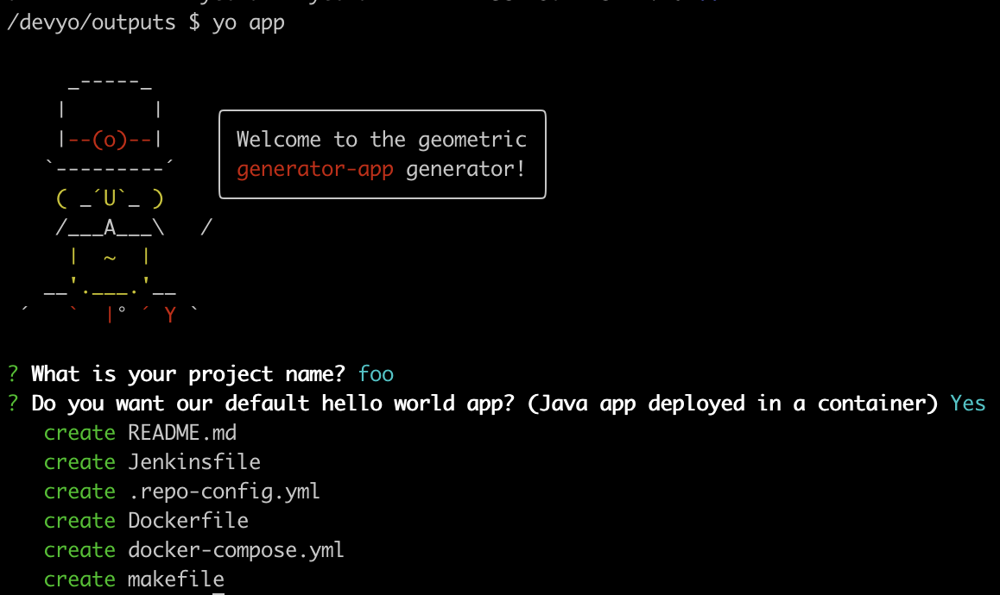

# In the fast lane

You can run this all yourself in docker...

```
docker build . -t devyo
docker run -v /PATH/TO/THIS/GIT/REPO/ON/YOUR/LOCAL:/devyo -it devyo sh

cd generator-app && npm link && cd -
mkdir outputs && cd outputs
yo app
```

You can do the same for any generator eg `generator-validation-check` or `generator-container`.


# More Info

Type of validators:
- **App:** [demo ready] Creates an application that can be deployed (eg hello world java application that responds on http)
- **Container:** [Not implmeneted yet] Creates a standalone container image that can be pushed to an artifact store (e.g for a runtime link python or go that can be consumed by something else)
- **Validation check:** [demo] Creates a new validation check folder that confirms to the standard outlined in the validation framework (not shown here but bascially make and docker)

Checkout the samples in `outputs-examples`. There are images showing what the end result looks like & samples of the templated files.


Hello World App:



Custom App:


# Do it all yourself!

## Create dev yeoman container

```
docker build . -t devyo
```

## Run dev yeoman container - and create a generator

```
docker run -v /path/to/your/code:/devyo -it devyo sh
```

### Creating your own generator

```
/devyo $ yo generator
```

### Working with an existing generator

Make your generator locally accessable:
```
/devyo $ cd generator-xxx
/devyo $ npm link
```

Create new project from a generator:
```
/devyo $ mkdir new-folder && cd new-folder
/devyo $ yo generator-xxx
```
